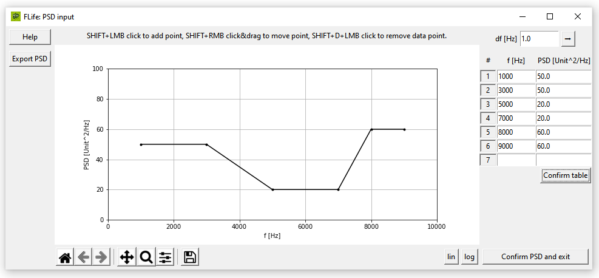
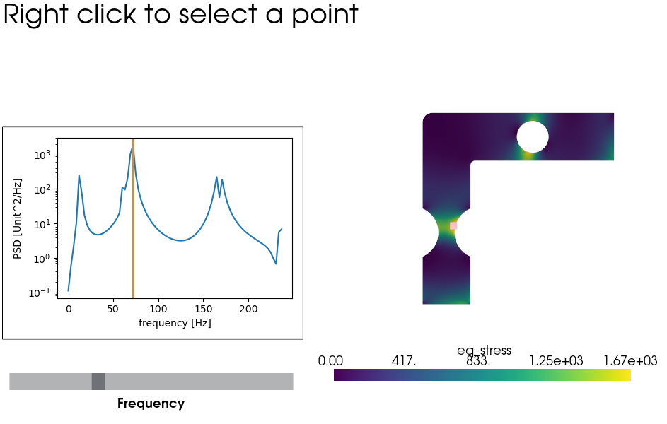
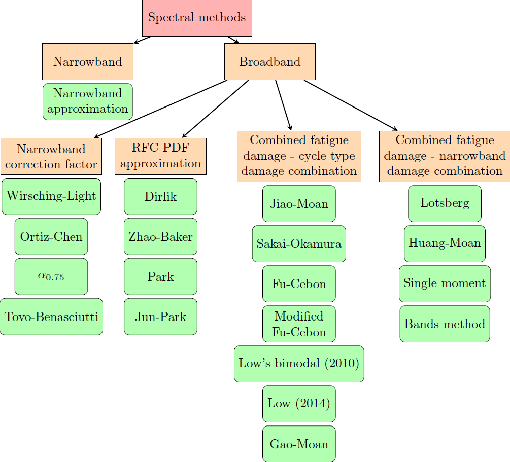

|pytest| |Docs Status| |zenodo|

FLife - Vibration Fatigue by Spectral Methods
---------------------------------------------

Obtaining vibration fatigue life in the spectral domain. For general theoretical
background on vibration fatigue (structural dynamics, uniaxial/multiaxial fatigue, 
non-Gaussianity, non-stationarity, etc), please see Slavič et al. [1], for 
theoretical background on different spectral domain methods, please see the review 
article by Zorman et al. [2] or original articles as given in the docstring
of the methods.

The review article [2] results are completely reproducible with ipynb file:
https://github.com/ladisk/FLife/blob/main/data/Vibration%20fatigue%20by%20spectral%20methods%20-%20a%20review%20with%20open-source%20support.ipynb

See the `documentation <https://flife.readthedocs.io/en/latest/index.html>`_ for more information.

Installing this package
-----------------------

Use `pip` to install it by:

.. code-block:: console

    $ pip install FLife

Supported methods in the frequency-domain
-----------------------------------------

    - Narrowband,
    - Wirsching Light,
    - Ortiz Chen,
    - Alpha 0.75,
    - Tovo Benasciutti,
    - Dirlik,
    - Zhao Baker,
    - Park,
    - Jun Park,
    - Jiao Moan,
    - Sakai Okamura,
    - Fu Cebon,
    - modified Fu Cebon,
    - Low's bimodal,
    - Low 2014,
    - Lotsberg,
    - Huang Moan,
    - Gao Moan,
    - Single moment,
    - Bands method

Rainflow (time-domain) is supported using the `fatpack` (four-points algorithm) and `rainflow` (three-points algorithm) packages.

Simple example
---------------

Here is a simple example on how to use the code:

.. code-block:: python

    import FLife
    import numpy as np

    dt = 1e-4
    x = np.random.normal(scale=100, size=10000)

    C = 1.8e+22  # S-N curve intercept [MPa**k]
    k = 7.3 # S-N curve inverse slope [/]

    # Spectral data
    input_dict = {'time_history': x, 'dt': dt}
    sd = FLife.SpectralData(input=input_dict)

    # Rainflow reference fatigue life 
    # (do not be confused here, spectral data object also holds the time domain data)
    rf = FLife.Rainflow(sd)

    # Spectral methods
    dirlik = FLife.Dirlik(sd)
    tb = FLife.TovoBenasciutti(sd)
    print(f'          Rainflow: {rf.get_life(C = C, k=k):4.0f} s')
    print(f'            Dirlik: {dirlik.get_life(C = C, k=k):4.0f} s')
    print(f'Tovo Benasciutti 2: {tb.get_life(C = C, k=k, method="method 2"):4.0f} s')

SpectralData
------------

SpectralData object contains data, required for fatigue-life estimation: power spectral density (PSD), spectral moments, spectral band estimators and others parameters. 

SpectralData is instantiated with `input` parameter:

    - `input` = 'GUI' - PSD is provided by user via GUI (graphically and tabulary)
    - `input` = dictionary with PSD and frequency vector is provided. (keys ``PSD`` and ``f``)
    - `input` = dictionary with time history and sampling period is provided. (keys ``time_history`` and ``dt``)

GUI
***

.. code-block:: python

    sd1 = FLife.SpectralData(input='GUI')
    sd2 = FLife.SpectralData()
    
This is default argument. User is prompted to enter PSD graphically and/or tabulary.

|GUI_img| 

Stationary Gaussian time-history is generated, if parameters `T` and `fs` are provided. Otherwise, time-history is generated subsequently, when Rainflow fatigue-life is calculated.
Optional parameter for time-history is random generator instance `rg` (numpy.random._generator.Generator), which determines phase of random process.

.. code-block:: python

    seed = 111
    rg =  np.random.default_rng(seed)
    # time-history can be generated at SpectralData object instantiation. Sampling frequency `fs` and signal length `T` parameter are needed.
    sd3 = FLife.SpectralData(input='GUI', T=1, fs=1e5, rg=rg)  
    
    time_history = sd3.data
    # time-history duration and sampling period are dependent on frequency vector length and step
    T = sd3.t # time-history duration
    dt = sd3.dt # sampling period 
    time = np.arange(0, T, dt)
    plt.plot(time, time_history)

(PSD, freq)
***********

PSD and frequency arrays are given as input. Both arrays must be of type np.ndarray. 

Stationary Gaussian time-history is generated, if parameters `T` and `fs` are provided. Otherwise, time-history is generated subsequently, when Rainflow fatigue-life is calculated.
Optional parameter for time-history is random generator instance `rg` (numpy.random._generator.Generator), which determines phase of random process.

.. code-block:: python

    seed = 111
    rg =  np.random.default_rng(seed)
    freq = np.arange(0,300)
    f_low, f_high = 100, 120
    A = 1 # PSD value
    PSD = np.interp(freq, [f_low, f_high], [A,A], left=0, right=0) # Flat-shaped one-sided PSD
    
    input_dict = {'PSD': PSD, 'f': freq}

    sd4 = FLife.SpectralData(input = input_dict)
    # time-history can be generated at SpectralData object instantiation. Sampling frequency `fs` and signal length `T` parameter are needed.
    sd5 = FLife.SpectralData(input = input_dict, T=1, fs=1e5, rg=rg)

    time_history = sd5.data
    # time-history duration and sampling period are dependent on frequency vector length and step
    T = sd5.t # time-history duration
    dt = sd5.dt # sampling period 
    time = np.arange(0, T, dt)
    plt.plot(time, time_history)

(x, dt)
*******

Time history `x` and sampling period `dt` are given as input. `x` must be of type np.ndarray and `dt` of type float, int.

.. code-block:: python

    seed = 111
    rg =  np.random.default_rng(seed)
    freq = np.arange(0,100)
    f_low, f_high = 40, 70
    A = 1 # PSD value
    PSD = np.interp(freq, [f_low, f_high], [A,A], left=0, right=0) # Flat-shaped one-sided PSD

    time, signal = FLife.tools.random_gaussian(freq=freq, PSD=PSD, T=10, fs=1e3, rg=rg)
    dt = time[1]

    input_dict = {'time_history': signal, 'dt': dt}

    sd6 = FLife.SpectralData(input=input_dict)

    # Get PSD data from spectralData object
    freq = sd6.psd[:,0]
    PSD = sd6.psd[:,1]
    plt.plot(freq, PSD)

Spectral Methods
-----------------

Currently 20 spectral methods are supported. Methods for broadband process are organized into 4 subgroups: 

    - Narrowband correction factor; methods are based on narrowband approximation, accounting for broadband procces with correction factor.
    - RFC PDF approximation; methods are based on approximation of Rainflow Probability Density Function.
    - Combined fatigue damage - cycle damage combination; methods are based on splitting of PSD of broadband process into N narrowband approximations and accounting the formation of distinct categories of cycles.
    - Combined fatigue damage - narrowband damage combination; methods are based on splitting of PSD of broadband process into N narrowband approximations and summing narrowband damages by suitable damage conbination rule.

|SpectralMethods_img|

SpectralData instance is prerequisite for spectral method instantiation. For multimodal spectral methods, PSD splitting type can be specified:

    - PSD_splitting=('equalAreaBands', N) - PSD is divided into N equal area bands. 
    - PSD_splitting=('userDefinedBands', [f_1_ub, f_2_ub, ..., f_i_ub, ..., f_N_ub])) - Band upper boundary frequency f_i_ub is taken as boundary between two bands, i.e.  i-th upper boundary frequency equals i+1-th lower boundary frequency.

.. code-block:: python
    
    nb = FLife.Narrowband(sd)
    dirlik = FLife.Dirlik(sd)
    tb = FLife.TovoBenasciutti(sd)
    jm1 = FLife.JiaoMoan(sd)
    jm2 = FLife.JiaoMoan(sd, PSD_splitting=('equalAreaBands', 2)) # same as jm1, PSD is divided in 2 bands with equal area
    jm3 = FLife.JiaoMoan(sd, PSD_splitting=('userDefinedBands', [80,150])) #80 and 150 are bands upper limits [Hz]

PDF
***

Some spectral methods supports PDF stress cycle amplitude via get_PDF(s, \**kwargs) function:

.. code-block:: python

    s = np.arange(0,np.max(x),.001)
    plt.plot(s,nb.get_PDF(s), label='Narrowband')
    plt.plot(s,dirlik.get_PDF(s), label='Dirlik')
    plt.plot(s,tb.get_PDF(s, method='method 2'), label='Tovo-Benasciutti')
    plt.legend()
    plt.show()

Vibration-fatigue life
**********************
Vibration-fatigue life is returned by function get_life(C,k,\**kwargs):

.. code-block:: python

    C = 1.8e+22  # S-N curve intercept [MPa**k]
    k = 7.3 # S-N curve inverse slope [/]
    
    life_nb = nb.get_life(C = C, k=k)
    life_dirlik = dirlik.get_life(C = C, k=k)
    life_tb = tb.get_life(C = C, k=k, method='method 1')

Rainflow
--------

Vibration-fatigue life can be compared to rainflow method. When Rainflow class is instantiated, time-history is generated and assigned to SpectralData instance, if not already exist. By providing optional parameter `rg` (numpy.random._generator.Generator instance) phase of stationary Gaussian time history is controlled.
    
.. code-block:: python

    sd = FLife.SpectralData(input='GUI') # time history is not generated at this point
    
    seed = 111
    rg =  np.random.default_rng(seed)
    rf1 = FLife.Rainflow(sd T=100, fs=1e3) # time history is generated and assigned to parameter SpectralData.data
    rf2 = FLife.Rainflow(sd, T=100, fs =1e3,  rg=rg) # time history is generated and assigned to parameter SpectralData.data, signal phase is defined by random generator
    rf_life_3pt = rf2.get_life(C, k, algorithm='three-point')
    rf_life_4pt = rf2.get_life(C, k, algorithm='four-point', nr_load_classes=1024) 
    
    error_nb = FLife.tools.relative_error(life_nb, rf_life_3pt)
    error_dirlik = FLife.tools.relative_error(life_dirlik, rf_life_3pt)
    error_tb = FLife.tools.relative_error(life_tb, rf_life_3pt)

Multiaxial vibration fatigue
-----------------------------

Multiaxial fatigue life estimation can be performed by using one of the
available frequency domain multiaxial criteria to convert multiaxial
stress state into equivalent uniaxial stress state. Resulting equivalent
uniaxial stress state can be used with all spectral methods, provided by
FLife.

Supported multiaxial criteria
-----------------------------

   - Maximum normal stress on critical plane
   - Maximum shear stress on critical plane
   - Maximum normal and shear stress on critical plane
   - EVMS (Equivalent von Misses stress)
   - Carpinteri-Spagnoli criterion
   - Frequency-based multiaxial rainflow criterion
   - Thermoelasticity-based criterion
   - EVMS adaptation for out-of-phase components
   - Nieslony criterion, combining EVMS and hydrostatic stresses
   - Equivalent Lemaitre stress
   - LiWI approach
   - COIN-LiWI method

Here is a simple example of using EVMS criterion on a multiaxial PSD for
the whole FEM model.

.. code-block:: python

   import FLife
   import numpy as np

   # Load multiaxial PSD data
   test_PSD = np.load('data/test_multiaxial_PSD_3D.npy')
   freq=np.arange(0,240,3)
   input_dict = {'PSD': test_PSD, 'f': freq}

   # Create EquivalentStress object
   eqs = FLife.EquivalentStress(input=input_dict,T=1,fs=5000)

   # Use multiaxial criterion
   eqs.EVMS()

   # manual critical point selection
   eqs.select_critical_point(point_index=331)

   # GUI critical point selection
   #FLife.visualize.set_mesh(eqs,'data/L_shape.vtk')
   #FLife.visualize.pick_point(eqs)

   # Define material properties
   C = 1.8e+22  # S-N curve intercept [MPa**k]
   k = 7.3  # S-N curve inverse slope [/]

   # Calculate fatigue life in seconds
   rf = FLife.TovoBenasciutti(eqs)
   fatigue_life = rf.get_life(C=C, k=k)
   print(f'Fatigue life: {fatigue_life:.2f} s')

Instead of manual point selection, critical point can be selected with
GUI by right clickling on the model. Heatmap of equivalent stress can be
shown at a desired frequency, set by the slider on the bottom-left side
of the GUI.

|GUI Multiaxial|

Some criteria are defined for multiaxial amplitude spectra instead of
multiaxial PSD. In this case, input must be a multiaxial amplitude
sprectrum (size (f,6) or (f,3) for single point, and (N,f,6) or (N,f,3)
for whole FEM model.) After the uniaxial equivalent stress is calculated
using the chosen criteria, PSD is calculated automatically and can be
used with all available spectral methods.

Here is a simple example of using one of the criteria defined for the
amplitude spectrum:

.. code-block:: python

   import FLife
   import numpy as np

   # Load multiaxial PSD data
   test_amplitude_spectrum_3D = np.load('data/test_multiaxial_amplitude_spectrum_3D.npy')
   freq=np.arange(0,240,3)
   input_dict = {'amplitude_spectrum': test_amplitude_spectrum_3D, 'f': freq}

   # Create EquivalentStress object
   eqs = FLife.EquivalentStress(input=input_dict,T=1,fs=5000)

   # Use multiaxial criterion
   eqs.coin_liwi(k_a=1.70, k_phi=0.90)

   # manual critical point selection
   eqs.select_critical_point(point_index=331)

   # GUI critical point selection
   #FLife.visualize.set_mesh(eqs,'data/L_shape.vtk')
   #FLife.visualize.pick_point(eqs)

   # Define material properties
   C = 1.8e+22  # S-N curve intercept [MPa**k]
   k = 7.3  # S-N curve inverse slope [/]

   # Calculate fatigue life in seconds
   rf = FLife.TovoBenasciutti(eqs)
   fatigue_life = rf.get_life(C=C, k=k)
   print(f'Fatigue life: {fatigue_life:.2f} s')

References:
    1. Janko Slavič, Matjaž Mršnik, Martin Česnik, Jaka Javh, Miha Boltežar. 
       Vibration Fatigue by Spectral Methods, From Structural Dynamics to Fatigue Damage – Theory and Experiments, 
       ISBN: 9780128221907, Elsevier, 1st September 2020, 
       `see Elsevier page. <https://www.elsevier.com/books/Vibration%20Fatigue%20by%20Spectral%20Methods/9780128221907?utm_campaign=ELS%20STBK%20AuthorConnect%20Release&utm_campaignPK=1695759095&utm_term=OP66802&utm_content=1695850484&utm_source=93&BID=1212165450>`_
    2. Aleš Zorman and Janko Slavič and Miha Boltežar. 
       Vibration fatigue by spectral methods—A review with open-source support, 
       Mechanical Systems and Signal Processing, 2023, 
       `see https://doi.org/10.1016/j.ymssp.2023.110149`
    3. Jaša Šonc, Klemen Zaletelj and Janko Slavič.
       Application of thermoelasticity in the frequency-domain multiaxial vibration-fatigue criterion, 
       Mechanical Systems and Signal Processsing, 2025
       `see https://doi.org/10.1016/j.ymssp.2024.112002`

.. |Docs Status| image:: https://readthedocs.org/projects/flife/badge/
   :target: https://flife.readthedocs.io

.. |pytest| image:: https://github.com/ladisk/flife/actions/workflows/python-package.yml/badge.svg
    :target: https://github.com/ladisk/flife/actions
   

    

.. |zenodo| image:: https://zenodo.org/badge/DOI/10.5281/zenodo.7417587.svg?
   :target: https://doi.org/10.5281/zenodo.7417587
